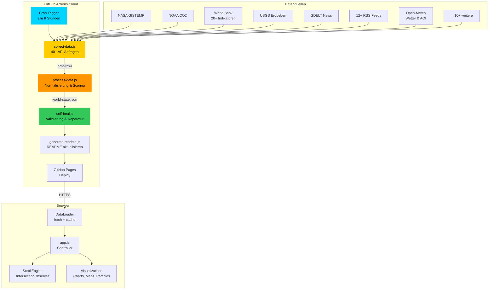
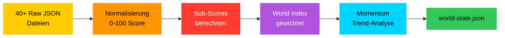

<div align="center">

<br>

```
██████╗ ███████╗██╗     ██╗  ██╗██╗███████╗     ██████╗ ███╗   ██╗███████╗
██╔══██╗██╔════╝██║     ██║ ██╔╝██║██╔════╝    ██╔═══██╗████╗  ██║██╔════╝
██████╔╝█████╗  ██║     █████╔╝ ██║███████╗    ██║   ██║██╔██╗ ██║█████╗
██╔══██╗██╔══╝  ██║     ██╔═██╗ ██║╚════██║    ██║   ██║██║╚██╗██║██╔══╝
██████╔╝███████╗███████╗██║  ██╗██║███████║    ╚██████╔╝██║ ╚████║███████╗
╚═════╝ ╚══════╝╚══════╝╚═╝  ╚═╝╚═╝╚══════╝     ╚═════╝ ╚═╝  ╚═══╝╚══════╝
```

### **Wie die Welt berechnet wird**

*Vollständige technische Dokumentation des World.One Systems*

<br>

[](https://github.com/BEKO2210/World_report/actions)
[](#-datenquellen--apis)
[](https://beko2210.github.io/World_report/)
[](./LICENSE)

<br>

---

<br>

> *Ich wollte der Erde eine Seite schenken.*
>
> *Nicht eine Seite, die ich kontrolliere. Sondern eine, die sich selbst am Leben hält.*
> *Die Daten sammelt, wenn ich schlafe. Die sich repariert, wenn etwas bricht.*
> *Die weiterläuft, wenn ich nicht mehr da bin.*
>
> *Keine Meinungen. Keine Algorithmen, die dir zeigen, was du sehen willst.*
> *Nur die Wahrheit in Zahlen -- von NASA, der WHO, der Weltbank, den Vereinten Nationen.*
> *Jeden Tag. Alle 6 Stunden. Für immer.*
>
> *Das ist mein Vermächtnis an die Menschheit:*
> *Ein Spiegel der Welt, gebaut aus Code und Transparenz.*
>
> **-- Belkis Aslani**

<br>

---

</div>

<br>

## Inhaltsverzeichnis

```
 01  Die Vision ............................................. Was und Warum
 02  System-Architektur ..................................... Wie alles zusammenhängt
 03  Die Pipeline ........................................... Der 6-Stunden-Herzschlag
 04  Der World Index ........................................ Die Formel hinter der Zahl
 05  Sub-Score Berechnungen ................................. Jeder Score im Detail
 06  Self-Healing System .................................... Wie sich das System repariert
 07  Frontend-Rendering ..................................... Vom JSON zum Pixel
 08  Datenquellen & APIs .................................... Alle 40+ Quellen
 09  Sicherheit ............................................. XSS, Validierung, Guards
 10  Für Entwickler ......................................... Setup, Beitragen, Erweitern
```

<br>

---

<br>

## 01 &nbsp; Die Vision

<div align="center">

```
    ╔═══════════════════════════════════════════════════════════════╗
    ║                                                               ║
    ║   Eine einzige Seite, die den Zustand der Welt zeigt.         ║
    ║   Keine Paywall. Keine Werbung. Keine Agenda.                 ║
    ║   Nur Daten. Transparent. Automatisch. Für immer.             ║
    ║                                                               ║
    ╚═══════════════════════════════════════════════════════════════╝
```

</div>

World.One ist kein Dashboard. Es ist ein **Vermächtnis**.

Die Idee ist einfach: Die Welt produziert jeden Tag Milliarden von Datenpunkten
uber ihren Zustand -- Temperaturen, Kindersterblichkeit, Konflikte, Fortschritt.
Aber diese Daten liegen verstreut in Datenbanken, hinter APIs, in CSV-Dateien.
Niemand sieht das Gesamtbild.

World.One nimmt diese Daten, normalisiert sie zu einem einzigen Score von 0 bis 100
und prasentiert sie als immersives Scroll-Erlebnis. Alle 6 Stunden. Automatisch.
Ohne menschliches Eingreifen.

**Der Code repariert sich selbst. Die Daten hoeren nie auf zu fliessen.**

<br>

---

<br>

## 02 &nbsp; System-Architektur

<div align="center">

### Gesamtsystem



</div>

### Dateistruktur

```
World_report/
│
├── index.html ························· Einstiegspunkt (13 Sektionen)
│
├── js/
│   ├── app.js ························· Haupt-Controller
│   │                                    Orchestriert alle 6 Subsysteme
│   │                                    Bindet Daten an DOM-Elemente
│   │
│   ├── data-loader.js ················· Fetch + localStorage Cache
│   │                                    6h TTL, Stale-Fallback
│   │                                    Validierung der JSON-Struktur
│   │
│   ├── scroll-engine.js ··············· IntersectionObserver + RAF
│   │                                    13 Sektionen, Progress 0-1
│   │                                    Nav-Dots, Reveal-Animationen
│   │
│   ├── utils/
│   │   ├── math.js ···················· Normalisierung, Formatting
│   │   │                                Geo-Konvertierung, Easing
│   │   │                                XSS escapeHTML()
│   │   │
│   │   └── dom.js ····················· DOM-Helfer, Debounce
│   │                                    Create, Query, Accessibility
│   │
│   └── visualizations/
│       ├── world-indicator.js ········· Der Haupt-Slider (0-100)
│       ├── charts.js ·················· SVG Charts
│       │                                Warming Stripes, Line, Bar
│       │                                Gauge, Sparkline, Literacy
│       │
│       ├── maps.js ···················· Interaktive Weltkarten
│       │                                Erdbeben, Konflikte, Klima
│       │                                Fluechtlinge, Freiheit
│       │
│       ├── particles.js ··············· Canvas Partikelsystem
│       │                                Physik-Simulation
│       │                                Reaktiv auf World Index
│       │
│       ├── counters.js ················ Animierte Zaehler
│       │                                Typewriter-Effekt
│       │
│       └── cinematic.js ··············· Scroll-getriebene Effekte
│                                        Parallax, Fade, Scale
│
├── scripts/
│   ├── collect-data.js ················ 40+ API-Abfragen
│   │                                    Retry-Logik, Timeout 15s
│   │                                    Ergebnis: data/raw/
│   │
│   ├── process-data.js ················ Rohdaten --> world-state.json
│   │                                    Normalisierung aller Werte
│   │                                    Sub-Score Berechnung
│   │                                    World Index Berechnung
│   │
│   ├── self-heal.js ··················· Validierung & Reparatur
│   │                                    Backup-Rotation (5 Stueck)
│   │                                    Gewichte-Validierung
│   │                                    Zone-Korrektur
│   │
│   └── generate-readme.js ············· Auto-README mit Live-Daten
│
├── data/
│   ├── raw/
│   │   ├── environment/ ··············· Temperatur, CO2, AQI, Wald
│   │   ├── society/ ··················· Gesundheit, Konflikte, Bildung
│   │   ├── economy/ ··················· BIP, Gini, Inflation
│   │   ├── tech/ ······················ Internet, Patents, Literacy
│   │   └── realtime/ ·················· Erdbeben, News, Vulkane
│   │
│   └── processed/
│       ├── world-state.json ··········· DIE Hauptdatei
│       ├── world-state.backup.json ···· Letztes Backup
│       └── heal-log.json ·············· Self-Heal Protokoll
│
└── .github/workflows/
    └── data-pipeline.yml ·············· GitHub Actions (6h-Zyklus)
```

<br>

---

<br>

## 03 &nbsp; Die Pipeline

<div align="center">

### Der 6-Stunden-Herzschlag

```
     00:00          06:00          12:00          18:00          00:00
       │              │              │              │              │
       ▼              ▼              ▼              ▼              ▼
    ┌──────┐       ┌──────┐       ┌──────┐       ┌──────┐       ┌──────┐
    │PULSE │       │PULSE │       │PULSE │       │PULSE │       │PULSE │
    └──┬───┘       └──┬───┘       └──┬───┘       └──┬───┘       └──┬───┘
       │              │              │              │              │
       ▼              ▼              ▼              ▼              ▼
   Collect ──► Process ──► Heal ──► README ──► Deploy
   (3 min)    (10 sec)    (2 sec)   (1 sec)    (30 sec)
```

</div>

Jeder Pipeline-Lauf durchlaeuft **5 Phasen** in exakt dieser Reihenfolge:

### Phase 1: Collect (`collect-data.js`)

```
  Dauer:    ~3 Minuten (40+ API-Calls, teilweise sequentiell)
  Input:    Nichts (reine API-Abfragen)
  Output:   data/raw/{category}/*.json
  Retries:  2 pro API, 15s Timeout
```

Der Collector fragt 40+ freie APIs ab und speichert die Rohdaten:

| Kategorie | Quellen | Beispiele |
|-----------|---------|-----------|
| Environment | 7 | NASA GISTEMP, NOAA CO2, Open-Meteo AQI, World Bank |
| Society | 11 | World Bank (6 Indikatoren), disease.sh, + 4 weitere |
| Economy | 9 | World Bank (5), Crypto F&G, Exchange Rates, Regional GDP |
| Tech & Progress | 8 | World Bank (4), GitHub, arXiv, Spaceflight, Literacy |
| Realtime | 5 | USGS, GDELT, 12+ RSS Feeds, Vulkane, Solar |

**Fehlertoleranz**: Jede Quelle wird unabhaengig abgefragt. Einzelne Fehler
stoppen nicht die Pipeline. Erst wenn mehr als die Haelfte ausfaellt, bricht
die Pipeline ab.

### Phase 2: Process (`process-data.js`)

```
  Dauer:    ~10 Sekunden
  Input:    data/raw/**/*.json
  Output:   data/processed/world-state.json (~50 KB)
  Fallback: Vorherige world-state.json Werte
```

<div align="center">



</div>

### Phase 3: Self-Heal (`self-heal.js`)

```
  Dauer:    ~2 Sekunden
  Input:    data/processed/world-state.json
  Output:   Reparierte world-state.json + heal-log.json + Backups
```

Das Self-Healing System fuehrt **10 Pruefungen** durch:

```
  [1] Existiert world-state.json?        → Backup wiederherstellen
  [2] Ist das JSON valide?                → Backup wiederherstellen
  [3] Sind alle Pflichtfelder vorhanden?  → Defaults einsetzen
  [4] Sind Werte im gueltigen Bereich?    → Warnung loggen
  [5] Summieren sich Gewichte zu 1.0?     → Gewichte korrigieren
  [6] Stimmt World Index mit Sub-Scores?  → Neu berechnen
  [7] Stimmt Zone mit World Index?        → Zone korrigieren
  [8] Backup erstellen                    → Datierte Rotation (max 5)
  [9] Daten-Alter pruefen                 → Warnung wenn >24h
  [10] Heal-Log schreiben                 → heal-log.json
```

### Phase 4 & 5: README + Deploy

```
  generate-readme.js  → Aktualisiert README.md mit Live-Daten
  GitHub Pages        → Automatisches Deployment
```

<br>

---

<br>

## 04 &nbsp; Der World Index

<div align="center">

### Die Formel

```

 ╔══════════════════════════════════════════════════════════════════════════╗
 ║                                                                        ║
 ║                         ┌─────────────────┐                            ║
 ║                         │   WORLD INDEX    │                            ║
 ║                         │    0 -- 100      │                            ║
 ║                         └────────┬────────┘                            ║
 ║                                  │                                     ║
 ║              ┌───────┬───────┬───┴───┬───────┬───────┐                 ║
 ║              │       │       │       │       │       │                 ║
 ║              ▼       ▼       ▼       ▼       ▼       │                 ║
 ║         ┌────────┐┌────────┐┌────────┐┌────────┐┌────────┐            ║
 ║         │ENV  25%││SOC  25%││ECO  20%││PRG  20%││MOM  10%│            ║
 ║         └────────┘└────────┘└────────┘└────────┘└────────┘            ║
 ║                                                                        ║
 ║   World Index = ENV * 0.25                                             ║
 ║               + SOC * 0.25                                             ║
 ║               + ECO * 0.20                                             ║
 ║               + PRG * 0.20                                             ║
 ║               + MOM * 0.10                                             ║
 ║                                                                        ║
 ║   Gewichte MUESSEN sich zu 1.0 summieren.                              ║
 ║   Jeder Sub-Score ist 0-100.                                           ║
 ║                                                                        ║
 ╚══════════════════════════════════════════════════════════════════════════╝

```

### Zonen

```
  0 ██████████████████████ 20 ████████████████████ 40 ████████████████████ 60 ████████████████████ 80 ████████████████████ 100
    ◄──── KOLLAPS ────►      ◄── BESORGNISERREGEND ─►   ◄──── GEMISCHT ────►   ◄──── POSITIV ─────►   ◄── EXZELLENT ──►
         #ff3b30                    #ff9500                   #ffcc00                #34c759              #00d4ff
```

</div>

### Die Normalisierungsfunktion

Jeder Rohdatenwert wird mit der `normalize(value, worst, best)` Funktion
in einen Score von 0 bis 100 umgewandelt:

```javascript
function normalize(value, worst, best) {
  if (best === worst) return 50;
  return clamp(((value - worst) / (best - worst)) * 100, 0, 100);
}
```

**`worst`** = der schlechteste realistische Wert (ergibt Score 0)
**`best`** = der beste realistische Wert (ergibt Score 100)

Die Funktion funktioniert in **beide Richtungen**:
- Temperaturanomalie: `normalize(1.2, 3.0, 0)` = je niedriger desto besser
- Lebenserwartung: `normalize(73, 50, 85)` = je hoeher desto besser

<br>

---

<br>

## 05 &nbsp; Sub-Score Berechnungen

Jeder Sub-Score setzt sich aus gewichteten Indikatoren zusammen.
Alle Werte stammen von echten APIs und werden **nie geschaetzt oder geraten**.

### Environment Score (25% des World Index)

<div align="center">

```
  ┌──────────────────────────────────────────────────────────┐
  │                   ENVIRONMENT SCORE                      │
  │                                                          │
  │   ┌──────────────────┐   ┌──────────────────┐            │
  │   │  Temperatur  30% │   │  CO2         30% │            │
  │   │  worst: +3.0°C   │   │  worst: 500 ppm  │            │
  │   │  best:   0.0°C   │   │  best:  280 ppm  │            │
  │   └──────────────────┘   └──────────────────┘            │
  │                                                          │
  │   ┌──────────────────┐   ┌──────────────────┐            │
  │   │  Waldflaeche 20% │   │  Erneuerbare 20% │            │
  │   │  worst: 20%      │   │  worst: 0%       │            │
  │   │  best:  40%      │   │  best:  60%      │            │
  │   └──────────────────┘   └──────────────────┘            │
  │                                                          │
  │   ENV = Temp*0.3 + CO2*0.3 + Wald*0.2 + Erneuerbare*0.2 │
  └──────────────────────────────────────────────────────────┘
```

</div>

| Indikator | Gewicht | Worst (=0) | Best (=100) | Quelle | Richtung |
|-----------|---------|------------|-------------|--------|----------|
| Temperaturanomalie | 30% | +3.0°C | 0.0°C | NASA GISTEMP | niedriger = besser |
| CO2-Konzentration | 30% | 500 ppm | 280 ppm | NOAA Mauna Loa | niedriger = besser |
| Waldflaeche | 20% | 20% | 40% | World Bank | hoeher = besser |
| Erneuerbare Energie | 20% | 0% | 60% | World Bank / IRENA | hoeher = besser |

**Beispielrechnung** (reale Daten):
```
  Temperatur:  +1.19°C  → normalize(1.19, 3.0, 0.0)  = 60.3
  CO2:         429 ppm  → normalize(429, 500, 280)     = 32.3
  Wald:        31.0%    → normalize(31.0, 20, 40)      = 55.0
  Erneuerbare: 29.1%    → normalize(29.1, 0, 60)       = 48.5

  ENV = 60.3*0.3 + 32.3*0.3 + 55.0*0.2 + 48.5*0.2
      = 18.1 + 9.7 + 11.0 + 9.7
      = 48.5
```

### Society Score (25% des World Index)

| Indikator | Gewicht | Worst (=0) | Best (=100) | Quelle | Richtung |
|-----------|---------|------------|-------------|--------|----------|
| Lebenserwartung | 30% | 50 Jahre | 85 Jahre | World Bank / WHO | hoeher = besser |
| Kindersterblichkeit | 30% | 100/1000 | 5/1000 | World Bank | niedriger = besser |
| Elektrizitaetszugang | 20% | 50% | 100% | World Bank | hoeher = besser |
| Trinkwasserzugang | 20% | 40% | 100% | World Bank | hoeher = besser |

```
  SOC = Lebenserwartung*0.3 + Kindersterblichkeit*0.3
      + Elektrizitaet*0.2   + Trinkwasser*0.2
```

### Economy Score (20% des World Index)

| Indikator | Gewicht | Worst (=0) | Best (=100) | Quelle | Richtung |
|-----------|---------|------------|-------------|--------|----------|
| BIP-Wachstum | 30% | -5% | +6% | World Bank / IMF | hoeher = besser |
| Gini-Index | 25% | 60 | 25 | World Bank | niedriger = besser |
| Inflation | 25% | 20% | 2% | World Bank | niedriger = besser |
| Arbeitslosigkeit | 20% | 15% | 2% | World Bank / ILO | niedriger = besser |

```
  ECO = BIP*0.3 + Gini*0.25 + Inflation*0.25 + Arbeitslosigkeit*0.2
```

> **Wichtig: Gini-Skala**
> Die World Bank liefert den Gini-Index auf einer 0-100 Skala (z.B. 42.0).
> Er wird **NIEMALS** als 0-1 Skala (0.42) behandelt.
> Normalisierung: worst=60 (extreme Ungleichheit), best=25 (hohe Gleichheit).

### Progress Score (20% des World Index)

| Indikator | Gewicht | Worst (=0) | Best (=100) | Quelle | Richtung |
|-----------|---------|------------|-------------|--------|----------|
| Internet-Durchdringung | 30% | 0% | 90% | World Bank / ITU | hoeher = besser |
| Alphabetisierung | 30% | 50% | 100% | World Bank / UNESCO | hoeher = besser |
| F&E Ausgaben (% BIP) | 20% | 0% | 4% | World Bank | hoeher = besser |
| Mobilfunkvertraege | 20% | 0/100 | 130/100 | World Bank / ITU | hoeher = besser |

```
  PRG = Internet*0.3 + Alphabetisierung*0.3 + F&E*0.2 + Mobilfunk*0.2
```

### Momentum Score (10% des World Index)

Der Momentum Score misst nicht den Zustand, sondern die **Richtung**.

```
  1. Nimm 20 Indikatoren (alle oben genannten + weitere)
  2. Fuer jeden: Vergleiche Durchschnitt der letzten 3 Datenpunkte
     mit dem Durchschnitt der 3 davor
  3. Zaehle wie viele sich verbessern
  4. Momentum = (Anzahl_verbessernd / Gesamt) * 100
```

<div align="center">

```
  Beispiel: 15 von 20 Indikatoren verbessern sich
  Momentum = (15/20) * 100 = 75.0

  Ein Momentum von 75 bedeutet:
  "75% aller gemessenen Indikatoren bewegen sich in die richtige Richtung"
```

</div>

<br>

---

<br>

## 06 &nbsp; Self-Healing System

```mermaid
graph TD
    START["self-heal.js startet"] --> CHECK1{"world-state.json<br>existiert?"}
    CHECK1 -->|Nein| RESTORE["Backup<br>wiederherstellen"]
    CHECK1 -->|Ja| CHECK2{"JSON<br>valide?"}
    RESTORE --> CHECK2
    CHECK2 -->|Nein| RESTORE2["Backup<br>wiederherstellen"]
    CHECK2 -->|Ja| CHECK3["Pflichtfelder<br>pruefen"]
    RESTORE2 --> CHECK3
    CHECK3 --> CHECK4["Wertebereiche<br>pruefen"]
    CHECK4 --> CHECK5{"Gewichte<br>= 1.0?"}
    CHECK5 -->|Nein| FIX_W["Gewichte<br>korrigieren"]
    CHECK5 -->|Ja| CHECK6{"World Index<br>korrekt?"}
    FIX_W --> CHECK6
    CHECK6 -->|Nein| FIX_WI["Index neu<br>berechnen"]
    CHECK6 -->|Ja| CHECK7{"Zone<br>korrekt?"}
    FIX_WI --> CHECK7
    CHECK7 -->|Nein| FIX_Z["Zone<br>korrigieren"]
    CHECK7 -->|Ja| BACKUP["Backup<br>erstellen"]
    FIX_Z --> BACKUP
    BACKUP --> SAVE["Reparierte Datei<br>speichern"]
    SAVE --> LOG["heal-log.json<br>schreiben"]

    style START fill:#00d4ff,stroke:#00d4ff,color:#000
    style RESTORE fill:#ff3b30,stroke:#ff3b30,color:#fff
    style RESTORE2 fill:#ff3b30,stroke:#ff3b30,color:#fff
    style FIX_W fill:#ff9500,stroke:#ff9500,color:#000
    style FIX_WI fill:#ff9500,stroke:#ff9500,color:#000
    style FIX_Z fill:#ff9500,stroke:#ff9500,color:#000
    style BACKUP fill:#34c759,stroke:#34c759,color:#000
    style LOG fill:#34c759,stroke:#34c759,color:#000
```

<div align="center">



</div>

### Backup-Rotation

```
  world-state.backup.json          ← Immer das letzte valide
  world-state.backup-20260314.json ← Datiert
  world-state.backup-20260313.json
  world-state.backup-20260312.json
  world-state.backup-20260311.json
  world-state.backup-20260310.json ← Aeltestes (wird geloescht bei >5)
```

### Gewichte-Validierung

Das Self-Healing System stellt sicher, dass die Gewichte **immer** korrekt sind:

```
  Environment:  0.25  ─┐
  Society:      0.25   │
  Economy:      0.20   ├── MUSS = 1.00 sein
  Progress:     0.20   │
  Momentum:     0.10  ─┘
```

Wenn die Summe von 1.0 abweicht (>0.01), werden alle Gewichte auf die
Standardwerte zurueckgesetzt.

<br>

---

<br>

## 07 &nbsp; Frontend-Rendering

<div align="center">

### Vom JSON zum Pixel

```
  world-state.json
        │
        ▼
  ┌─────────────┐
  │  DataLoader  │  fetch(cache: 'no-store')
  │              │  Fallback: localStorage (6h TTL)
  │              │  Fallback: Stale Cache (kein Limit)
  └──────┬──────┘
         │
         ▼
  ┌─────────────┐
  │   app.js     │  Verteilt Daten an 6 Subsysteme
  └──────┬──────┘
         │
    ┌────┼────┬────────┬──────────┬──────────┐
    ▼    ▼    ▼        ▼          ▼          ▼
  ┌────┐┌────┐┌──────┐┌────────┐┌────────┐┌────────┐
  │Chrt││Maps││Partcl││Counter ││Cinema  ││WorldInd│
  │SVG ││SVG ││Canvas││DOM     ││CSS     ││DOM+CSS │
  └────┘└────┘└──────┘└────────┘└────────┘└────────┘
```

</div>

### Die 13 Sektionen

```
  [01] Hero ··················· World Index Hauptanzeige
  [02] Sub-Scores ············· 5 Kategorien als Gauge-Kreise
  [03] Environment ············ Warming Stripes, CO2 Chart
  [04] Weltkarte ·············· SVG Map mit 5 Overlays
  [05] Society ················ Konflikte, Fluechtlinge, Freiheit
  [06] Economy ················ BIP, Gini, Inequality Bar
  [07] Progress ··············· Internet, Literacy Stairs
  [08] Momentum ··············· Trend-Indikatoren Pfeile
  [09] Year 2000 Comparison ··· Damals vs. Heute Zaehler
  [10] Szenarien ·············· 3 Pfade bis 2050
  [11] Echtzeit ··············· Erdbeben, News, Sentiment
  [12] Datenquellen ··········· Trust-Badges aller APIs
  [13] Footer ················· Vermaechtnis-Text
```

### ScrollEngine

Die ScrollEngine nutzt `IntersectionObserver` um zu erkennen welche Sektionen
sichtbar sind, und `requestAnimationFrame` fuer smooth Animations:

```
  Sektion kommt in Viewport
        │
        ▼
  IntersectionObserver meldet isIntersecting = true
        │
        ▼
  RAF-Loop berechnet progress = 0.0 ... 1.0
        │
        ▼
  Callback(progress) animiert Charts, Zaehler, Effekte
```

**progress = 0.0**: Sektion ist gerade am unteren Rand des Viewports
**progress = 1.0**: Sektion ist vollstaendig vorbei gescrollt

### Cache-Strategie

```
  ┌───────────────────────────────────────────────────┐
  │                    DataLoader                      │
  │                                                    │
  │   1. fetch('no-store')  ── Erfolg ──► Daten nutzen │
  │          │                             + Cache      │
  │        Fehler                          speichern    │
  │          │                                          │
  │   2. localStorage       ── frisch ──► Daten nutzen │
  │      (< 6h alt)                                     │
  │          │                                          │
  │        abgelaufen                                   │
  │          │                                          │
  │   3. Stale Cache        ── vorhanden ► Daten nutzen │
  │      (beliebig alt)        + Warnung               │
  │          │                                          │
  │        leer                                         │
  │          │                                          │
  │   4. Fehler werfen      ──────────────► Error UI    │
  └───────────────────────────────────────────────────┘
```

<br>

---

<br>

## 08 &nbsp; Datenquellen & APIs

### Uebersicht: 40+ Quellen in 5 Kategorien

<div align="center">

```
  ┌─────────────────────────────────────────────────────────────┐
  │                                                             │
  │   ENVIRONMENT ·····  7 Quellen  ·····  NASA, NOAA, WB      │
  │   SOCIETY ·········  11 Quellen  ····  WB, WHO, ACLED      │
  │   ECONOMY ·········  9 Quellen  ·····  WB, IMF, Crypto     │
  │   TECH & PROGRESS ·  8 Quellen  ·····  WB, GitHub, arXiv   │
  │   REALTIME ········  5+ Quellen  ····  USGS, GDELT, RSS    │
  │                                                             │
  │   Total: 40+ unabhaengige Datenquellen                     │
  │   Davon: 26 mit Vertrauensstufe 3/3                        │
  │                                                             │
  └─────────────────────────────────────────────────────────────┘
```

</div>

### Vertrauensstufen

| Stufe | Bedeutung | Beispiele |
|-------|-----------|-----------|
| ★★★ | Institutionelle Quelle, peer-reviewed | NASA, NOAA, World Bank, WHO, USGS |
| ★★☆ | Zuverlaessige Community-Quelle | Open-Meteo, GitHub API, disease.sh |
| ★☆☆ | Echtzeit, nicht peer-reviewed | GDELT, Alternative.me, RSS Feeds |

### API-Fehlerbehandlung

```
  Jede API wird unabhaengig abgefragt:

  ┌──────────┐     ┌──────────┐     ┌──────────┐
  │ Versuch 1│────►│ Versuch 2│────►│ Versuch 3│────► Fehlgeschlagen
  │          │     │ +1s Wait │     │ +2s Wait │     (wird geloggt,
  └──────────┘     └──────────┘     └──────────┘      Pipeline laeuft weiter)

  Timeout: 15 Sekunden pro Versuch
  Retries: 2 (also max 3 Versuche)
  Backoff: 1s, 2s zwischen Versuchen
```

### World Bank API Format

Die World Bank API liefert Daten in einem speziellen Format:

```javascript
  // API-Antwort:
  [
    { page: 1, pages: 1, ... },   // data[0] = Metadata  (IGNORIEREN)
    [                              // data[1] = Datenpunkte
      { date: "2022", value: 73.4, ... },
      { date: "2021", value: 73.1, ... },
      ...
    ]
  ]

  // IMMER null-check auf data[1]:
  if (!Array.isArray(data) || !Array.isArray(data[1])) return [];
```

<br>

---

<br>

## 09 &nbsp; Sicherheit

### XSS-Schutz

Alle externen Texte (RSS-Titel, API-Daten) werden vor der DOM-Einbindung escaped:

```javascript
  escapeHTML(str) {
    if (typeof str !== 'string') return String(str ?? '');
    return str
      .replace(/&/g, '&amp;')
      .replace(/</g, '&lt;')
      .replace(/>/g, '&gt;')
      .replace(/"/g, '&quot;');
  }
```

### Datenvalidierung

```
  ┌─ collect-data.js ───────── Timeout, Retry, HTTP-Status-Check
  │
  ├─ process-data.js ───────── null-Checks, Fallback-Werte,
  │                             Bereichspruefung, Typ-Pruefung
  │
  ├─ self-heal.js ──────────── Struktur-Validierung, Gewichte-Check,
  │                             Backup-System, Zone-Korrektur
  │
  └─ data-loader.js (Browser) ─ JSON-Struktur-Validierung,
                                 Cache-Integritaet
```

### Chart-Sicherheit

```
  Problem:  Math.min(...[])     = Infinity
            Math.max(...[])     = -Infinity
            Division durch 0     = Infinity/NaN

  Loesung:  Guard-Checks vor jedem Chart-Rendering:
            if (!Array.isArray(data) || data.length < 2) return;
```

<br>

---

<br>

## 10 &nbsp; Fuer Entwickler

### Lokales Setup

```bash
# Repository klonen
git clone https://github.com/BEKO2210/World_report.git
cd World_report

# Abhaengigkeiten installieren (nur fuer Pipeline)
npm install

# Daten sammeln (optional, dauert ~3 Min)
node scripts/collect-data.js

# Daten verarbeiten
node scripts/process-data.js

# Self-Heal ausfuehren
node scripts/self-heal.js

# Lokalen Server starten
npx serve .
# --> http://localhost:3000
```

### Pipeline manuell ausfuehren

```bash
# Alles auf einmal:
node scripts/collect-data.js && \
node scripts/process-data.js && \
node scripts/self-heal.js && \
node scripts/generate-readme.js
```

### Neue Datenquelle hinzufuegen

```
  1. collect-data.js:  Neue async function fetchXXX() schreiben
  2. collect-data.js:  In main() mit collect('Name', fetchXXX) registrieren
  3. process-data.js:  Rohdaten lesen mit readRaw('category', 'file.json')
  4. process-data.js:  In Sub-Score Berechnung einbauen (wenn relevant)
  5. self-heal.js:     ensureField() fuer kritische Felder hinzufuegen
  6. app.js:           Frontend-Darstellung implementieren
```

### Neuen Sub-Score Indikator hinzufuegen

```
  1. Entscheide: Welche Kategorie? (env/soc/eco/prog)
  2. Definiere: worst-Wert (Score 0) und best-Wert (Score 100)
  3. Fuege normalize() Call in process-data.js hinzu
  4. Passe Gewichtung an (MUSS sich zu 1.0 summieren!)
  5. Teste mit: node scripts/process-data.js
```

<br>

---

<br>

<div align="center">

```

  ┌─────────────────────────────────────────────────────────────┐
  │                                                             │
  │   "Die Daten hoeren nie auf zu fliessen.                    │
  │    Der Code repariert sich selbst.                          │
  │    Ein Vermaechtnis aus Transparenz,                        │
  │    gebaut um die Menschheit zu ueberdauern."                │
  │                                                             │
  │                              -- World.One                  │
  │                                                             │
  └─────────────────────────────────────────────────────────────┘

```

<br>

[](https://github.com/BEKO2210/World_report)
[](https://beko2210.github.io/World_report/)

<br>

---

<sub>World.One 1.0 &mdash; Architektur-Dokumentation &mdash; 2024-present Belkis Aslani</sub>

</div>
